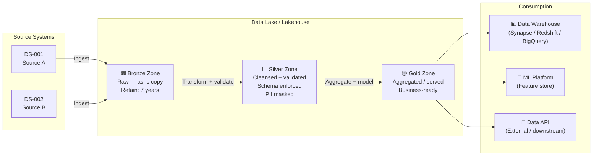

# Data Lineage & Governance — mohamad hafiz 

---

## Medallion Architecture

---

## Lineage Map — Key Datasets

| Dataset (Gold) | Derived From (Silver) | Source (Bronze) | Transformation | Owner |
|----------------|-----------------------|-----------------|---------------|-------|
| `dim_customer` | `clean_customers` | DS-001 | Deduplicate + mask PII | *[Team]* |
| `fact_orders` | `clean_orders` + `clean_customers` | DS-001, DS-002 | Join + aggregate | *[Team]* |
| `kpi_revenue` | `fact_orders` | Derived | Sum + currency normalisation | *[Team]* |

---

## Governance Policies

### Schema Change Management

- All schema changes to Silver and Gold datasets **require a pull request** with:
  - Updated DDL / schema file
  - Migration script
  - Downstream impact assessment
  - Approval from Data Steward

### Data Stewardship

| Domain | Data Steward | Data Owner (Business) |
|--------|-------------|----------------------|
| Customer | *[Name]* | *[Business role]* |
| Financial | *[Name]* | *[Business role]* |
| Operational | *[Name]* | *[Business role]* |

### Retention & Deletion

| Zone | Retention | Deletion Process | GDPR Right-to-Erasure |
|------|-----------|-----------------|----------------------|
| Bronze | 7 years | Archive to cold tier, then delete | *[Process — row-level delete + log]* |
| Silver | 3 years | Scheduled job | *[Process]* |
| Gold | 2 years | Rebuild from Silver | *[Process]* |

### Access Audit

- All access to PII-containing datasets is logged to `audit_access_log` table.
- Audit logs retained for *[X years]* per compliance requirement.
- Monthly access review performed by Data Steward.
