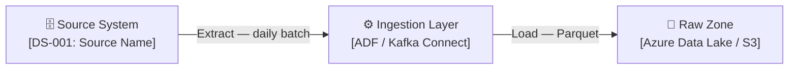

# Data Sources Catalogue — mohamad hafiz 

> This document is the authoritative catalogue of all upstream data sources
> that feed into the platform. It captures ownership, schema, SLAs, and access patterns.

---

## Source Inventory

| ID | Source Name | System / Owner | Type | Format | Frequency | Volume / Day | SLA |
|----|------------|----------------|------|--------|-----------|-------------|-----|
| DS-001 | *[Source A]* | *[Team / System]* | *[DB / API / File]* | *[CSV / JSON / Parquet]* | *[Daily / RT]* | *[GB]* | *[2 h lag]* |
| DS-002 | *[Source B]* | | | | | | |
| DS-003 | *[Source C]* | | | | | | |

---

## Source Detail: DS-001 — *[Source Name]*

| Attribute | Value |
|-----------|-------|
| System owner | *[Team name]* |
| Technical owner | *[DBA / API team]* |
| Connection type | *[JDBC / REST API / SFTP / Event stream]* |
| Auth method | *[Service principal / API key / OAuth]* |
| Extract mode | *[Full / Incremental — watermark column: `updated_at`]* |
| Frequency | *[Daily at 02:00 UTC]* |
| Format | *[CSV / JSON / Avro / Parquet]* |
| Typical size | *[X GB / day]* |
| Schema location | *[Link to schema registry or DDL file]* |
| PII present | *[Yes / No — fields: name, email, …]* |
| Contractual SLA | *[Data available by 03:00 UTC]* |

**Key fields:**

| Field | Type | Nullable | PII | Description |
|-------|------|----------|-----|-------------|
| `id` | string | No | No | Primary key |
| `created_at` | timestamp | No | No | Record creation time |
| `email` | string | Yes | **Yes** | Customer email — mask in curated |
| *[field]* | | | | |

---

## Source Detail: DS-002 — *[Source Name]*

> *Duplicate this block for each data source.*

---

## Known Data Quality Issues

| Source | Issue | Frequency | Workaround |
|--------|-------|-----------|-----------|
| DS-001 | *[e.g., `status` field sometimes arrives as NULL]* | ~5% of records | *[Default to "UNKNOWN"]* |
| DS-002 | | | |

---

## Data Classification Summary

| Source | Classification | Regulation | Masking Required |
|--------|---------------|------------|-----------------|
| DS-001 | Confidential — PII | GDPR | Yes — in curated zone |
| DS-002 | Internal | None | No |
