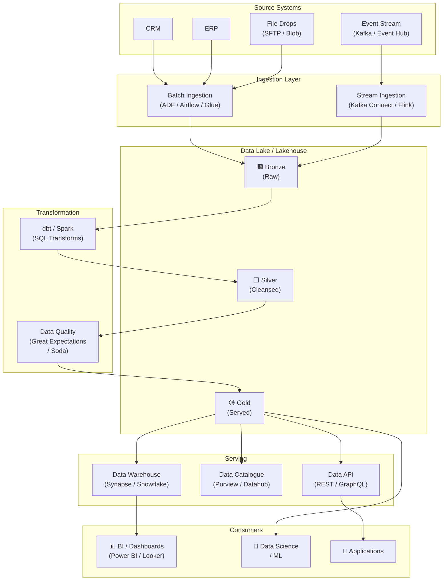

# High-Level Solution Design — mohamad hafiz 

> **Platform type:** Data & Analytics Platform

---

## Architecture Overview

---

## Component Summary

| Component | Technology | Responsibility |
|-----------|-----------|----------------|
| Batch Ingestion | *[ADF / Apache Airflow / AWS Glue]* | Scheduled extraction from source systems |
| Stream Ingestion | *[Kafka Connect / Azure Event Hubs + Flink]* | Real-time event capture |
| Data Lake | *[ADLS Gen2 / S3 / GCS]* | Raw and cleansed data storage (Bronze/Silver/Gold) |
| Transformation | *[dbt / Apache Spark]* | Data modelling and business logic |
| Data Quality | *[Great Expectations / Soda / dbt tests]* | Schema and rule validation at each zone |
| Data Warehouse | *[Synapse Analytics / Snowflake / BigQuery]* | Optimised analytical query engine |
| Data Catalogue | *[Microsoft Purview / DataHub / Alation]* | Discoverability, lineage, and governance |
| Data API | *[FastAPI / Azure API Management]* | Programmatic access for downstream apps |

---

## Key Design Decisions

- *[Decision 1 — e.g., "Medallion (Bronze/Silver/Gold) architecture chosen over a two-tier approach for data quality isolation"]*
- *[Decision 2 — e.g., "dbt chosen over Spark for Silver transforms due to SQL-first team skillset and lower operational overhead"]*
- *[Decision 3 — e.g., "All PII masked at Bronze→Silver boundary using deterministic tokenisation"]*
