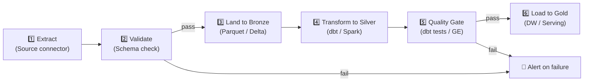
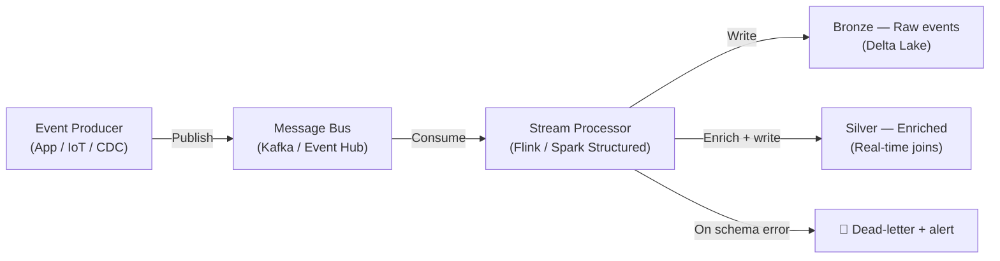

# Ingestion Engine Design — mohamad hafiz 

---

## Ingestion Patterns

| Pattern | Use Case | Technology | Latency Target |
|---------|----------|-----------|---------------|
| Full load | Initial load / small reference tables | *[ADF / Airbyte]* | *[< 4 h]* |
| Incremental (watermark) | Transactional tables with `updated_at` | *[ADF / Airflow]* | *[< 2 h]* |
| CDC (Change Data Capture) | Low-latency operational data | *[Debezium / DMS]* | *[< 5 min]* |
| Streaming | Event-driven / IoT / clickstream | *[Kafka / Event Hub + Flink]* | *[< 60 s]* |
| File-based | Partner feeds / exports | *[ADF / S3 event trigger]* | *[< 1 h after file arrival]* |

---

## Batch Ingestion Pipeline

---

## Stream Ingestion Pipeline

---

## Error Handling & Retry Policy

| Scenario | Behaviour | Retry Strategy | Alert |
|----------|-----------|---------------|-------|
| Source system unavailable | Pause pipeline | Exponential backoff (3 attempts, max 30 min) | Yes — P2 |
| Schema drift detected | Quarantine records | Manual review required | Yes — P1 |
| Transformation failure | Fail pipeline | Fix and re-run from checkpoint | Yes — P2 |
| Quality gate breach | Quarantine dataset | Alert data steward | Yes — P1 |
| Duplicate events | Deduplicate on primary key | Idempotent upsert | No |

---

## Monitoring & Observability

- **Pipeline health:** *[Airflow / ADF monitoring dashboard]*
- **SLA tracking:** Alert when ingestion latency > *[threshold]* for source *[X]*
- **Data freshness metric:** `max(ingested_at)` per source published to monitoring dashboard
- **Volume anomaly:** Alert when record count deviates > *[±30%]* from 7-day rolling average
