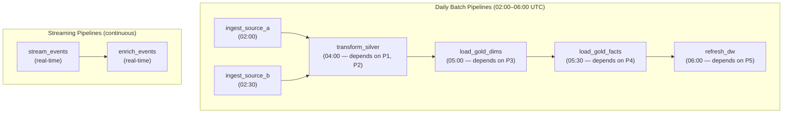
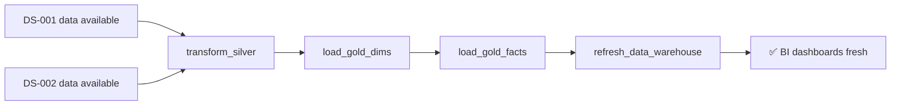

# Data Pipeline Flows — mohamad hafiz 

---

## Pipeline Overview

---

## Pipeline Details

### Pipeline: `ingest_source_a`

| Attribute | Value |
|-----------|-------|
| Schedule | Daily at 02:00 UTC |
| Source | DS-001 — *[Source A]* |
| Target | Bronze zone — `raw/source_a/` |
| Mode | Incremental (watermark: `updated_at`) |
| Expected duration | *[< 30 min]* |
| SLA | Complete by 03:00 UTC |
| On failure | Alert + retry ×3 |

---

### Pipeline: `transform_silver`

| Attribute | Value |
|-----------|-------|
| Schedule | Daily at 04:00 UTC (after ingest pipelines) |
| Source | Bronze zone |
| Target | Silver zone |
| Engine | *[dbt / Spark]* |
| Models | *[List dbt models or Spark jobs]* |
| PII handling | Mask / tokenise before writing Silver |
| Quality checks | dbt tests: not_null, unique, accepted_values, relationships |
| Expected duration | *[< 45 min]* |

---

### Pipeline: `stream_events`

| Attribute | Value |
|-----------|-------|
| Trigger | Continuous |
| Source | *[Kafka topic: `events.raw`]* |
| Target | Bronze zone — Delta table `raw/events/` (partitioned by day) |
| Checkpoint | *[ADLS / S3 — checkpoint dir]* |
| Micro-batch interval | *[10 s]* |
| Late arrival tolerance | *[1 h watermark]* |

---

## Dependency Graph

