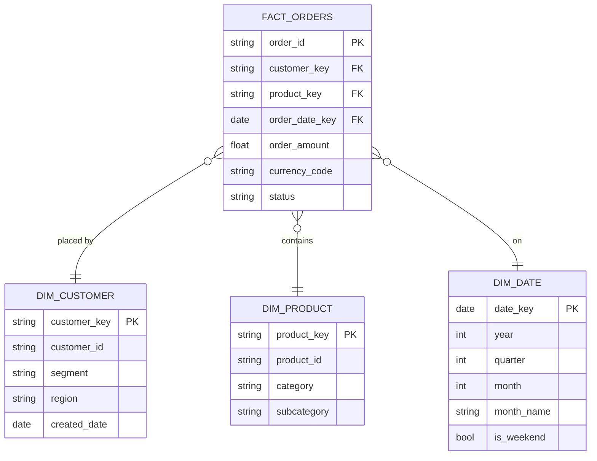

# Storage Tiers & Data Modelling — mohamad hafiz 

---

## Storage Tier Summary

| Tier | Zone | Format | Partitioning | Retention | Who Writes | Who Reads |
|------|------|--------|-------------|-----------|-----------|---------|
| Raw | Bronze | Parquet / Delta | year/month/day | 7 years | Ingestion pipelines | Engineers only |
| Cleansed | Silver | Delta | year/month/day + entity key | 3 years | dbt / Spark jobs | Engineers + Data Scientists |
| Served | Gold | Delta / Parquet | By domain | 2 years | dbt / Spark jobs | Analysts + BI + APIs |
| Archive | Cold storage | Compressed Parquet | year/month | 7–15 years | Lifecycle policy | Audit / Legal only |

---

## Gold Layer Data Model (Dimensional)

> Replace with the actual dimensional model for **mohamad hafiz **.

---

## Table Naming Conventions

| Pattern | Example | Description |
|---------|---------|-------------|
| `raw_{source}_{entity}` | `raw_crm_customers` | Bronze zone raw tables |
| `stg_{source}_{entity}` | `stg_crm_customers` | Silver staging (dbt staging models) |
| `int_{entity}` | `int_customers` | Silver intermediate joins |
| `dim_{entity}` | `dim_customer` | Gold dimension tables |
| `fact_{process}` | `fact_orders` | Gold fact tables |
| `agg_{subject}_{grain}` | `agg_revenue_monthly` | Gold aggregate tables |

---

## Compaction & Optimisation Policy

- **Delta vacuum:** Run `VACUUM` weekly, retain 7 days of history.
- **OPTIMIZE / Z-ORDER:** Run on large tables (> 100 GB) weekly, Z-ORDER by most common filter columns.
- **Small file compaction:** Triggered after streaming writes reach *[X files per partition]*.
- **Statistics refresh:** `ANALYZE TABLE` run after major loads for query optimiser.
