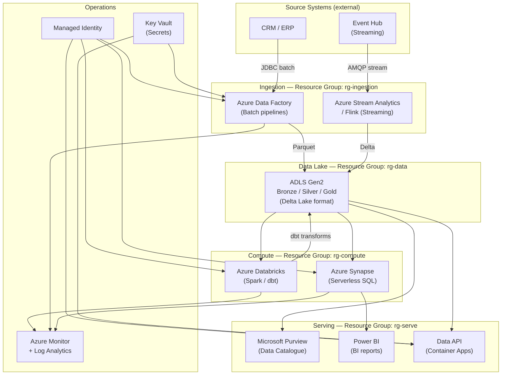

# Lakehouse Cloud Topology — mohamad hafiz 

> Template assumes **Microsoft Azure**. Adapt labels for AWS (S3, Glue, Redshift) or GCP (GCS, Dataform, BigQuery) as needed.

---

## Cloud Topology Diagram

---

## Resource Inventory

| Resource | SKU / Config | Region | Purpose |
|----------|-------------|--------|---------|
| ADLS Gen2 | Standard LRS / ZRS | *[Region]* | Lakehouse storage — all zones |
| Azure Data Factory | *[Standard]* | *[Region]* | Batch orchestration |
| Azure Databricks | *[Premium / Standard cluster]* | *[Region]* | Spark compute for transforms |
| Azure Synapse Analytics | *[Serverless SQL]* | *[Region]* | Ad-hoc analyst queries |
| Microsoft Purview | *[Standard]* | *[Region]* | Data governance + catalogue |
| Azure Monitor | *[Pay-as-you-go]* | *[Region]* | Pipeline + infra monitoring |
| Key Vault | Standard | *[Region]* | Source credentials, connection strings |

---

## Network & Security Controls

- **Private endpoints:** ADLS, Key Vault, Databricks accessed via private endpoints only.
- **Managed Identity:** All services authenticate to ADLS and Key Vault via MI — no stored credentials.
- **Encryption:** ADLS encrypted with Microsoft-managed keys (upgrade to CMK for regulated data).
- **Network isolation:** Databricks deployed in *[VNet injection]* mode; no public IP on clusters.
- **RBAC on ADLS:** ACLs enforced at the container and folder level per zone and role.
